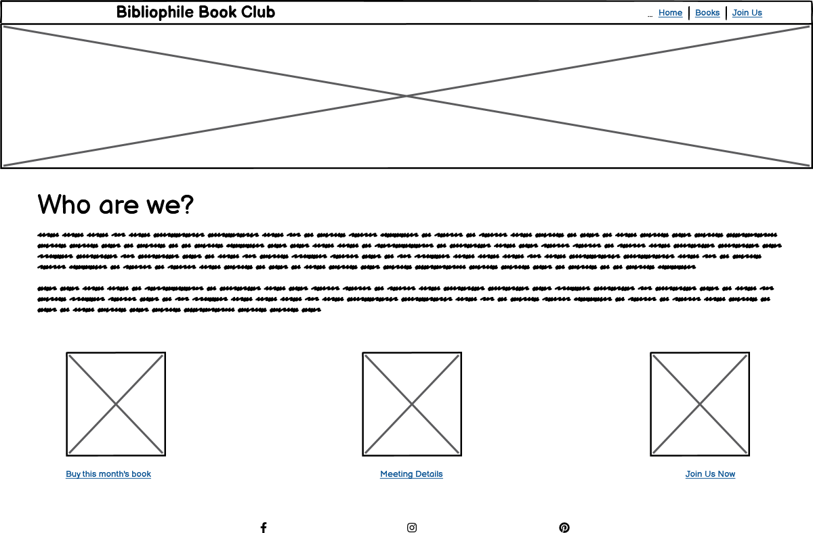
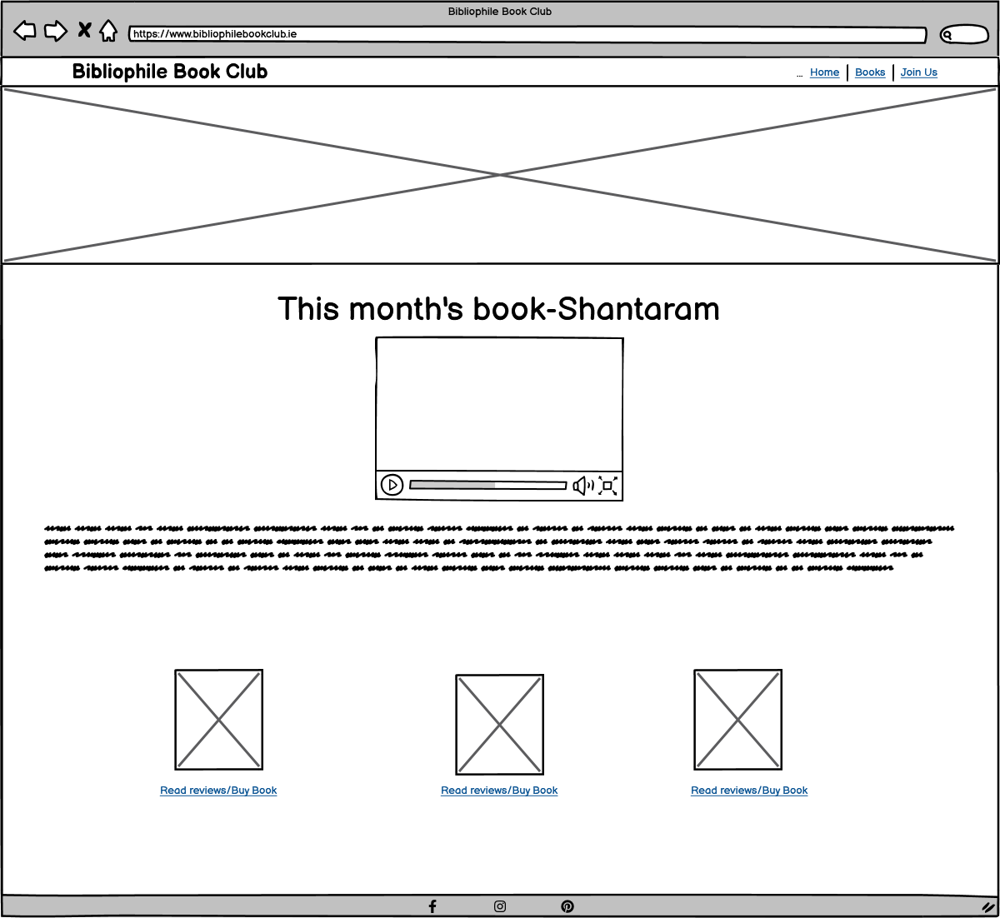
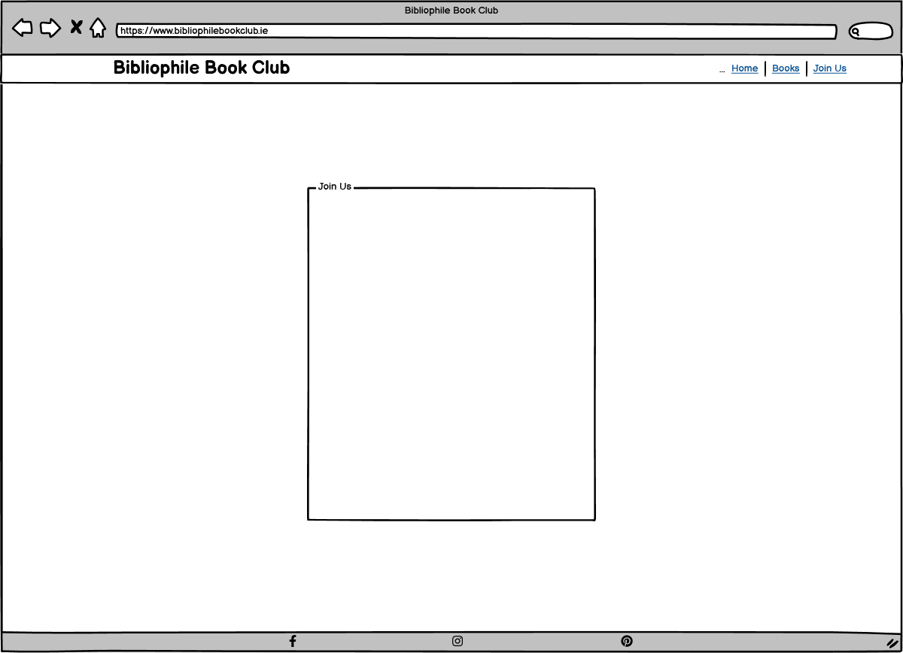
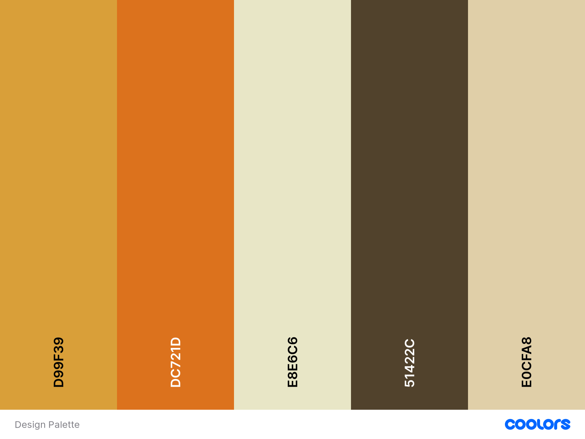
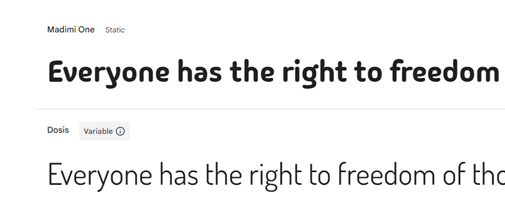

# Bibliophile-Book Club

[View live project here on GitHub](https://elizadoeslots.github.io/Bibliophile-Book-Club/)

Bibliophile Book Club is a book club for adults based in Roscam, Co. Galway. The book club meet in the Cumasu Center twice a week on a Tuesday morning and evening at 10am and 7pm.
Members can bring along tea, coffee and treats to the morning club and wine if they wish to the evening meet-up.

The Bibliophile Book Club website is set up to provide information to people wishing to join a group such as meeting times, what to bring and location. It also provides them with a means to join the bookclub on the join us page. New members can choose whether they want to join the morning or evening group.

For existing members, the site provides information on what the club are currently reading and links to where they can read reviews and purchase books.

   
  
  
  ---

## CONTENTS  
  
* [UXD (User Experience Design)](#user-experience-ux)
  * [User Stories](#user-stories) 
* [Creation process (Strategy -> Surface)](#creation-process)
  * [Wireframes](#wireframes)
* [Design](#design)
  * [Colour Scheme](#color-scheme)
  * [Typography](#typography)
  * [Imagery](#imagery)
* [Page Features](#page-features)
  * [Navbar](#navbar)
  * [Hero-Image](#hero-image)
  * [Tagline & Call to Action](#tagline--call-to-action)
  * [Business Ethos](#business-ethos)
  * [Menu Page](#menu-page)
  * [Contact Page](#contact-page)
  * [Footer](#footer)  
* [Tablet & Mobile View](#tablet--mobile-view)
  * [Desktop, Tablet & Mobile Differences](#desktop-tablet--mobile-differences)
  * [Tablet View](#tablet-view-ipad-miniipad-prosurface-pro)
  * [Mobile View](#mobile-view-iphone-5iphone-seiphone-xriphone-12-pro)
* [Future Features](#future-features)
* [Technologies Used](#technologies-used)
  * [Languages Used](#languages-used)
  * [Frameworks, Libraries, Technologies & Programs Used](#frameworks-libraries-technologies--programs-used)
* [Deployment](#deployment)
  * [How to deploy](#how-to-deploy)
* [Testing](#testing)
  * [HTML Validation using W3C Validation](#html-validation-using-w3c-validation)
  * [CSS Validation using W3C Validation](#css-validation-using-w3c-validation)
  * [Lighthouse scores via Chrome Developer Tools](#lighthouse-scores-via-chrome-developer-tools)
  * [Bugs & Fixes](#bugs--fixes)
  * [Unsolved Bugs](#unsolved-bugs)
* [Credits](#credits) 

  
---    
## User Experience (UX)  
  
### **User Stories**  

### **Primary Goal**  
  
The Bibliophile Book Club website is set up to provide information to new and existing members, while endeavouring to convey a very welcoming, inclusive club to new members.
### **Visitor Goals** 

The Bibliophile Book Club is a book club for adults living in Roscam and the surrounding areas. The age range is from 18+ so it is imperative that the site is easy to navigate and fully accessible. The site is responsive so that visitors can access it from devices such as mobile phone, desktop and tablet.
Each page is easy to read, accessible from the navigation bar and provide essential information such as location, meet-up times and an about us page for first time visitors.

The club organisers undertand that it can be daunting walking into a room full of strangers for the first time so it was essential that the site conveys a strong welcome message to potential members. As a result warm, welcoming yet hip colours were used in the site's design.

### **First Time Visitor**
  - A first time visitor should be able to find out exactly what the club is about.
  - A first time visitor should be able to easily access about the location and meet-up times.
  - A first time visitor should be able to join the club through a sign-up form and receive an email verification and welcome message.
  - A first time visitor should experience a warm, welcoming environment that encourages them to join.
  - A first time visitor should be able to find information on the book the club is currently reading.
  - A first time visitor should be able to read reviews and purchase books from links provided to third party sites.
  - A first time visitor should be able to access the club's social media accounts for all club updates from the sites.

### **Returning Visitor**  
  - A returning visitor should have access to meeting times and location.
  - A returning visitor should be able to read reviews and purchase books from links provided to third party sites.
  - A returning visitor should be able to find information on the book the club is currently reading.
  - A returning visitor should to be able to easily access resources related to the current book selection, such as discussion questions, author interviews, or supplementary materials.
  - A returning visitor should be able to access the club's social media accounts for all club updates from the sites.
  
### **Frequent Visitor**  
  - A frequent visitor should be able to access the social media accounts for all club updates from the site.
  - A frequent visitor should be able to access any new materials/ resources added to the site by the club organisers after each weekly meeting.
  - A frequent visitor should be able read reviews and purchase books through links to third party sites.

--- 
## Creation Process  
  
### **1. Strategy**  

#### Vision
The vision for the Bibliophile Brigade book club website is to create a user-centered platform that promotes inclusiveness and engagement utilising seamless navigation to obtain information about the club 
and discover a variety of literary works and resources.

#### Goals

##### Increase membership
Increase the book club membership and numbers at club meetings.

##### Expand reach
Reach a wider audience by providing a website where users can easily access club information.

##### Hightlight book of the month.
Showcase and provide information about the book of the month. Provide resources for discussion topics about the book.

##### Provide book reviews and links  where books can be purchased.
 Provide links to third party book shops to purchase books.

### **2. Scope**  

##### Homepage
  -Provide a navigation bar with easy to identify, clickable links to the other site pages.  
  -Include a footer with links out to social media platforms.
  -Include information about the club and its ethos.
  -Include clickable call to actions to join us, buy this month's book and check out this months book.

##### Books
  -Provide a navigation bar with easy to identify, clickable links to the other site pages.
  -Include a footer with links out to social media platforms.
  -Include an image of the book.
  -Include a synopsys of the book.
  -Include discussion questions.
  -Include links to reviews.

##### Join US
  -Provide a navigation bar with easy to identify, clickable links to the other site pages.
  -Include a footer with links out to social media platforms..
  -Create a Join US form encouraging people to join the club.

### **3. Structural**  

##### Home Page

  -Features a user-friendly navigation bar for easy access to key sections.
  -Provides an overview of the club, goals, and featured book of the month.
  -Includes prominent call-to-action buttons for joining the club and purchasing the current month's book.

##### Books Page

  -Displays detailed information about the book of the month, including an image, synopsis, discussion questions, and reviews.
  -Offers convenient links for purchasing the book from third-party sellers.

##### Join Us Page

  -Offers a simple and inviting form for users to join the book club.

##### Other Features
  -The site is optimised for responsive design across all devices-tablet, desktop, mobile.
  -The site is fully accessible to ensure a positive, seamless user experience for all users.
  
### **4. Skeleton**  

Wireframes were created for the site using Balsamiq. These provided a working model of the site throughout the design process as design decisions were made and user experience was considered.
The wireframes created are linked below:

Wireframe - Homepage
  

 

Wireframe - Books page
  

 

Wireframe - Join Us page
  

    

### **5. Surface**  
Once the content for the website was chosen, I began to look at the design and aesthetics of the site.
## Design  

### **Color Scheme**  
In order to create a very inclusive book club website, I incorporated yellows, browns, and oranges into the surface plane design to evoke warmth, accessibility, and diversity

Yellow: Yellow symbolizes energy, happiness, and optimism. It will be utilised as an accent color to draw attention to important elements on the website, such as navigations and calls to action.

Brown: Brown signifies stability, reliability, and earthiness. It will serve as the primary background color for the website, providing a sense of grounding and comfort. 
  
Orange: Orange represents creativity, enthusiasm, and encouragement. It will be incorporated into the design through highlights, borders, or decorative elements to add vibrancy and excitement. 

  
  
### **Typography**  
  
I used [Google Fonts](https://fonts.google.com/) to import the fonts 'Dosis' and 'Madimi One' defaulting to sans -serif. I like the fun, retro element of Madimi One for the logo and button text. Dosis was chosen to have a consistent, ligible font fot the rest of the body text. 
  

        
### **Imagery**  

Images and icons were taken from and/or created in Canva and are all royalty free. I chose an inviting image for the hero image of people of all ages to highlight the diversity of the book club.
  ## Deployment

### **How to deploy**  

GitHub was used to deploy the website. These were the steps taken to acheive this:  

1. Login to GitHub account
2. Navigate to the project repository, Bibliophile Book Club
3. Click the Settings button.
4. In the left-hand menu, click the Pages button
5. In the Source section, choose 'main' from the drop-down, select branch menu
6. Select 'root' from the drop-down folder menu
7. Click 'Save' and after a few moments the project will be made live and a link is visible at the top of the page

---  
    

---  
  

 
---   

